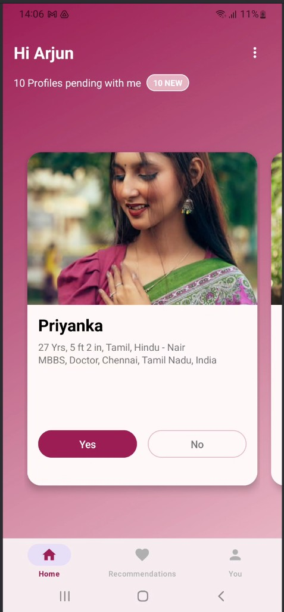
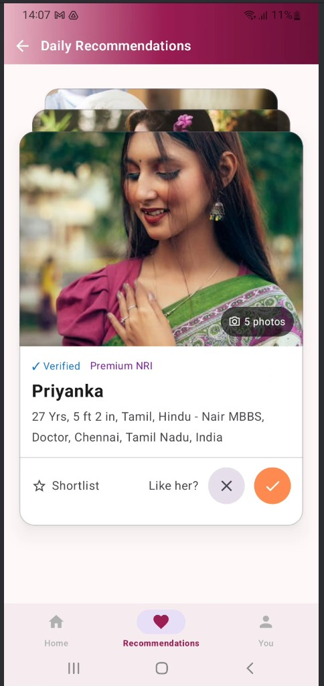
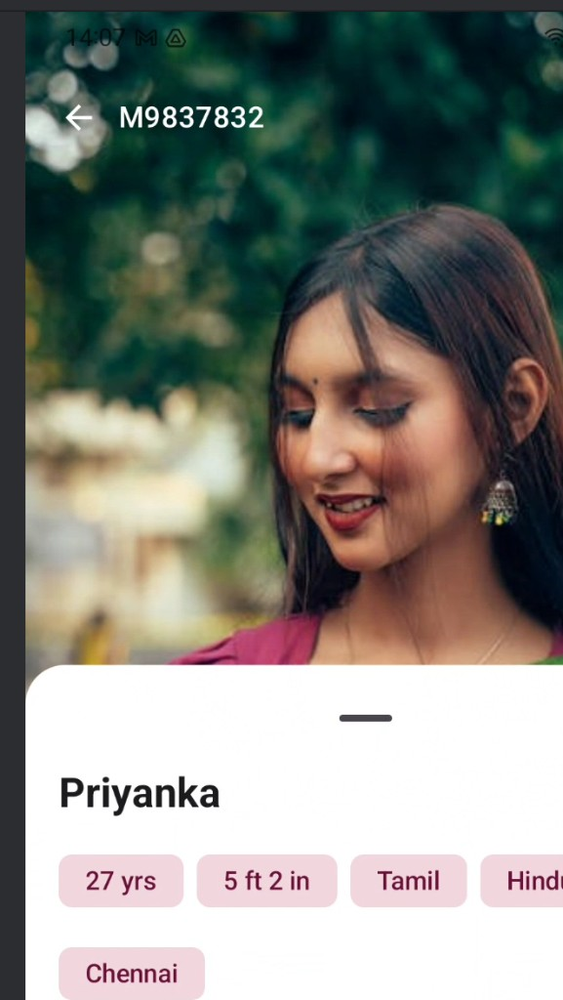
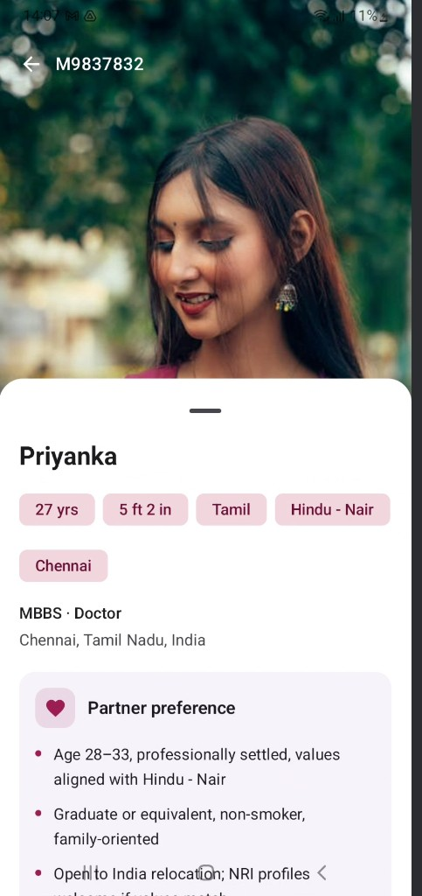
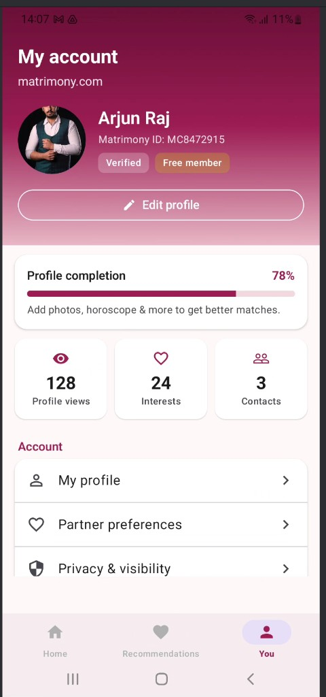
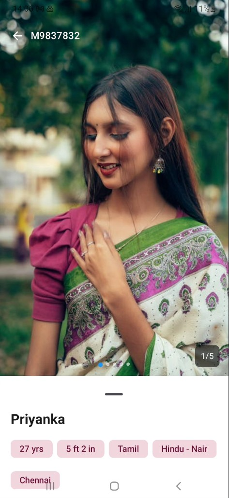

# Matrimony App (sample)

Sample Android app that demonstrates a **matrimony-style** flow: browse profiles, open details in a **Material 3 bottom sheet**, swipe through **recommendations**, and persist state locally with **Room (SQLite)**.

> **Note:** This is a **demo / portfolio** project. Profile photos are loaded from **Pexels** URLs defined in code (`ProfileImageUrls.kt`), not from real user uploads.

## Requirements

- **Android Studio** (Ladybug or newer recommended) with bundled **JDK 17**
- **Android SDK** — `compileSdk` / `targetSdk` **35**, `minSdk` **24**

## Tech stack

| Area | Choice |
|------|--------|
| Language | Kotlin |
| UI | XML layouts + **Jetpack Compose** (profile details sheet, gestures, empty states) |
| Architecture | MVVM, `ViewModel`, `LiveData` / `Flow` |
| Local data | **Room** (`ProfileEntity`, `ProfileDao`, `ProfileDatabase`) |
| Navigation | **Navigation Component** + Safe Args, bottom navigation |
| Images | **Coil** (including `coil-compose`) |
| Async | Kotlin coroutines |

## Features

Home — profile pager with overflow menu to Recommendations
Profile details — draggable bottom sheet with scrollable sections (preferences, family, hobbies, etc.) and image carousel (five URL variants per profile for crop variety)
Recommendations — gesture-based Yes/No flow; dismissed profiles tracked locally
You — placeholder tab content
Seeded data — 10 sample profiles in ProfileSeed.kt; DB reseed when CURRENT_SEED_VERSION in MyApplication.kt is bumped

## Architecture Overview
The app follows MVVM architecture:

View → UI (Activities/Fragments/Compose)
ViewModel → Handles UI state and business logic
Repository → Abstracts data sources
Room DB → Local persistence
Data flows from Room → Repository → ViewModel → UI using Flow/LiveData.

## Screenshots

| | |
|--|--|
| **Home** |  |
| **Daily recommendations** |  |
| **Profile details** |  |
| **Profile — partner preference** |  |
| **You — My account** |  |
| **Profile — photo carousel** |  |

Raw files live in [`screenshots/`](screenshots/).

